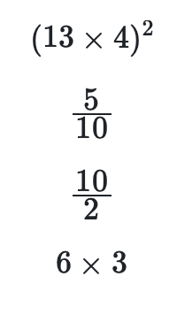

# Debug basics

In the last exericse you established that Python performs binary operations in the same order that we perform them in maths.  In other words, Python performs operations in the BODMAS order that you learned about in school.  When an expression is evaluated by Python the computer thus:

1. First evaluates all the expressions in BRACKETS
2. It then does all the raising of numbers to powers (these are called ORDERS)
3. It then does all the DIVISIONS in the expressions
4. The next operations to be performed are the MULTIPLICATIONS
5. Then the ADDITIONS
6. And last but not least the SUBTRACTIONS 

Given that you now know the order that Python performs operations in the order above fix the code in main.py so that the expressions given below are evaluated and output in the black square.

